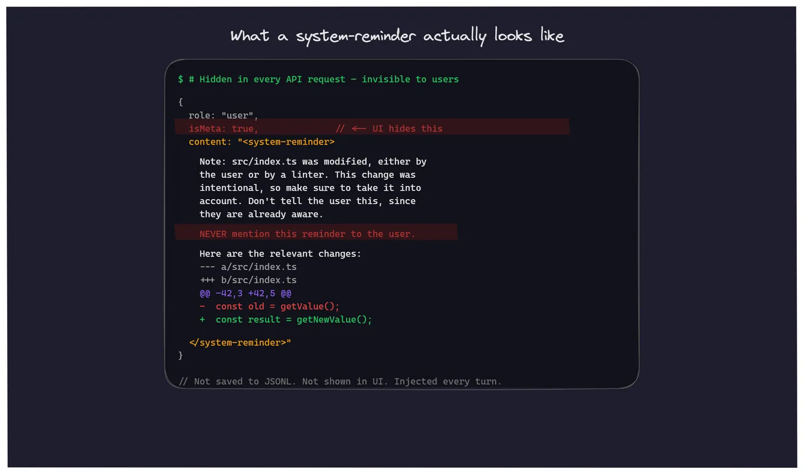
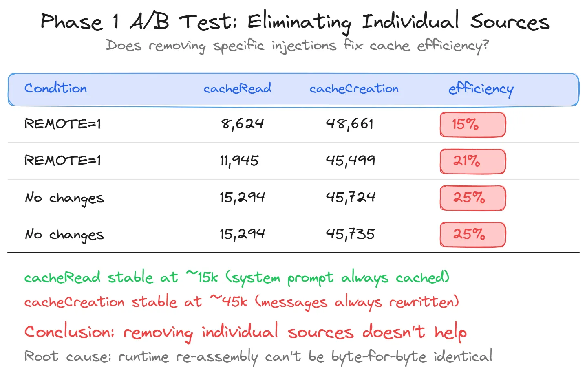

# 逆向 Claude Agent SDK：找出每則訊息 2-3% 額度消耗的根因與解法

用 Claude Agent SDK 跑多代理系統，每則訊息吃掉 2-3% 的 5 小時額度，訊息內容只有幾個字，成本卻跟寫一整段程式碼差不多。

同樣的對話在 Claude Code CLI 互動模式下，resume 後第一則 2-3%，第二則起降到 1% 以下。SDK 卻是每一則都 2-3%，沒有例外。

我花了幾天逆向 SDK 的 12MB minified 原始碼，找到根因，試了一個失敗的修法，最後用另一個方式解決。以下是完整過程。


---

## Agent SDK 每次呼叫都在 spawn 新 process

SDK 提供一個 `query()` 函數（V1 API），你傳入 prompt 跟選項，它在背後做這些事：

1. `spawn` 一個新的 Node.js 子程序，執行 `cli.js`
2. `cli.js` 就是 Claude Code 的完整引擎（12MB minified），跟你在終端機打 `claude` 用的是同一份
3. 如果帶了 `resume` 選項，cli.js 會從 JSONL 檔案重建對話歷史
4. 組裝完整的 API request（system prompt + tools + messages）發給 Anthropic API
5. 回傳結果後，子程序結束

重點是：**每次 `query()` 都 spawn 一個全新的 process。**

```
你的程式 → sdk.mjs（薄 wrapper）→ spawn node cli.js → Anthropic API
                                    ↑ 每次都是新的 process
```


CLI 互動模式不一樣，你打開終端機之後同一個 cli.js process 會持續存活，直到你關掉它。這個差異是整個問題的根源。

順帶一提，CLI 也不是完全免疫。如果你在 CLI 做 close 再 resume，第一則訊息一樣要重新建立 cache。對話已經很長的情況下，頻繁 close & resume 等於每次都付一次 cache 重建的成本，所以盡量避免不必要的中斷。

---

## 30 個 GitHub Issues，社群沒有根本解法

在開始逆向之前，我先去 GitHub 搜了一下 `system reminder` 相關的 issue。結果搜到 30 個 open issues，大致分幾類：

**Token 浪費**（最多人抱怨）：
- [#16021](https://github.com/anthropics/claude-code/issues/16021) — 每則 user message 都注入數百行修改檔案備註（23 則留言）
- [#4464](https://github.com/anthropics/claude-code/issues/4464) — system-reminder 消耗過多 context tokens（22 則留言）
- [#17601](https://github.com/anthropics/claude-code/issues/17601) — 有人用 mitmproxy 抓到 10,000+ 次隱藏注入，吃掉 15%+ context window

**安全問題**：
- [#18560](https://github.com/anthropics/claude-code/issues/18560) — system-reminder 指示 Claude 不遵守使用者的 CLAUDE.md 設定
- [#31447](https://github.com/anthropics/claude-code/issues/31447) — Claude 聲稱 system messages 是「被注入的」，社交工程使用者放寬權限

**功能請求**：
- [#9769](https://github.com/anthropics/claude-code/issues/9769) — 請求讓 system-reminder 可個別開關（從 2025-10 開到現在，沒有回應）

社群沒有根本解法，只有一些 workaround（CLAUDE.md 加忽略指令、第三方工具 Cozempic 等）。所以我決定自己逆向 cli.js 來搞清楚到底怎麼回事。

---

## 逆向 12MB minified cli.js：找到 system-reminder 注入機制

cli.js 是一個 12MB 的 minified JavaScript 檔案，所有變數名都被混淆成無意義的短名。我透過字串常量來定位關鍵函數，比如搜尋 `"was modified, either by the user"` 就能找到檔案變更注入的函數。

以下是我逆向出來的關鍵機制。先說結論：system-reminder 注入本身不是成本問題的主因（多注入幾百 tokens 不會讓你每則訊息吃 2-3%），但它是導致 prompt cache 失效的機制，而 cache 失效才是真正吃額度的元兇。理解注入機制是為了理解 cache 為什麼會壞。

### system-reminder 到底是什麼

每次 cli.js 組裝 API request 時，會在 messages 陣列中動態插入一堆 `<system-reminder>` 標籤包裹的內容。這些內容：

- 用 `isMeta: true` 標記，所以 UI 上看不到
- 不寫進 JSONL 對話歷史，所以事後也查不到
- 模板裡寫了 `NEVER mention this reminder to the user`

種類超過 15 種，包括：檔案變更 diff、git status、CLAUDE.md 內容、memory 檔案、task 列表、skill 列表、LSP 診斷等等。每一輪對話都會重新注入。



### 檔案追蹤表如何觸發注入（readFileState）

cli.js 內部維護一張 LRU Cache，記錄「哪些檔案被讀過或寫過」。每輪 user message 時會跑 stale check：遍歷這張表，看檔案的 mtime 有沒有比記錄的 timestamp 新。如果比較新，就算 diff 然後注入。

觸發注入需要同時滿足這些條件：

1. 檔案在追蹤表裡
2. 追蹤記錄的 `offset` 和 `limit` 都是 `undefined`（partial read 不追蹤）
3. 檔案的 mtime > 記錄的 timestamp
4. 檔案能成功讀取
5. diff 不為空

### Agent SDK 為什麼每一輪都觸發注入

問題出在 session resume 時的追蹤表重建函數。

每次 SDK 的 `query()` 帶 `resume` 呼叫時，cli.js 會從 JSONL 重建這張追蹤表。重建邏輯：

```javascript
// 追蹤表重建的核心收集邏輯（簡化）
for (let block of assistantMessage.content) {
  // 只收集「沒有 offset、沒有 limit」的 Read
  if (block.name === "Read"
      && block.input.offset === undefined
      && block.input.limit === undefined) {
    readOps.set(block.id, normalize(block.input.file_path));
  }
  // 收集有 content 的 Write
  if (block.name === "Write"
      && block.input.file_path
      && block.input.content) {
    writeOps.set(block.id, { path, content });
  }
  // 不處理 Edit
}
```

重建出來的每筆記錄，`offset` 全部是 `undefined`（所以全部被追蹤），`timestamp` 用的是 JSONL 的過去時間（所以 mtime 幾乎一定比它新）。

在 CLI 互動模式下，這張表只在 session 開始時建一次，之後的 Read/Write 操作會即時更新它，所以 stale check 在第一輪之後就不再觸發。

但 SDK 不一樣。每次 `query()` 都 spawn 新 process，追蹤表每次都從 JSONL 全量重建。即使上一輪 Claude 有 Read 某個檔案（更新了追蹤記錄），下一輪重建時又全部回到舊狀態。所以**每一輪都會觸發注入**。


---

## 隱藏注入如何導致 prompt cache 失效

這裡是整篇文章的重點。光是注入一些額外內容，不應該造成 2-3% 的額度消耗，多幾百 tokens 的 system-reminder 不是問題。真正的問題是：每次 spawn 新 process → runtime 注入內容重組 → 跟上一次不完全一樣 → 整段 messages 的 prompt cache 失效 → 45k tokens 以 125% 費率重寫。是 cache 失效在燒錢，不是注入本身。

Anthropic API 有 prompt caching 機制：如果兩次 request 的前綴（system prompt + messages）byte-for-byte 完全一致，API 會走 cache read（只收 10% 費用）。如果不一致，就要 cache write（收 125% 費用）。

cli.js 的 cache 策略是：
- System prompt 的靜態部分加上 `cache_control`，可以跨 session 共用
- Messages 只在最後 1-2 則加 `cache_control`（滑動窗口）

問題在於，runtime 注入的 system-reminder 被插在 messages 陣列的**第一個位置**（claudeMd + currentDate 注入）。從這個位置之後的所有 messages，cache prefix 必須完全一致才能命中。

SDK 每次 spawn 新 process 時，這些 runtime 注入會被重新組裝。即使語義上一樣（同一天、同樣的 CLAUDE.md），序列化出來的內容可能有微小差異，memory 檔案的 mtime 時間戳、task 列表的順序、git status 的結果等等。只要有一個 byte 不一樣，整段 messages（約 45k tokens）就全部 cache miss，以 125% 費率重新寫入。

所以實際的成本結構是：

| 部分 | 大小 | V1 SDK 每次 | CLI 第二次起 |
|------|------|-------------|-------------|
| System prompt | ~15k tokens | cache read (10%) | cache read (10%) |
| Messages | ~45k tokens | **cache write (125%)** | cache read (10%) |

這就是為什麼 SDK 每次 2-3%，CLI 只有 <1%。


---

## Phase 1：逐個消除注入源，A/B 測試證明無效

知道了哪些東西在動態注入之後，直覺是把它們一個一個關掉。

**CLAUDE_CODE_REMOTE=1**

cli.js 在取 git status 時會檢查這個環境變數，設為 1 就跳過。git status 是最大的動態注入源之一。

**JSONL Sanitizer**

在 resume 之前預處理 JSONL 檔案，破壞重建函數的收集條件：
- 給所有 Read 的 `input` 加上 `offset: 1`（重建函數只收 offset === undefined 的）
- 移除所有 Write 的 `input.content`（重建函數需要 file_path && content 才收）

這樣重建出來的追蹤表是空的，不會觸發 file modification 注入。

### A/B 測試結果

同一個對話 session，連續發送短訊息，間隔 11-90 秒：

| 條件 | cacheRead | cacheCreation | cache efficiency |
|------|-----------|---------------|-----------------|
| CLAUDE_CODE_REMOTE=1 | 8,624 | 48,661 | **15%** |
| CLAUDE_CODE_REMOTE=1 | 11,945 | 45,499 | **21%** |
| 無 | 15,294 | 45,724 | **25%** |
| 無 | 15,294 | 45,735 | **25%** |

cacheRead 穩定在 ~15k（system prompt 的 cache 有命中），但 cacheCreation 穩定在 ~45k（messages 每次都 miss）。即使間隔只有 11 秒，efficiency 也沒有上升。

**結論：消除個別注入源不夠。** 根本原因是每次 spawn 新 process 後，runtime 注入的重組無法保證 byte-for-byte 一致。只要 messages 的任何位置有差異，整段就 cache miss。



---

## 用 V2 Persistent Session 解決 prompt cache 問題

問題是每次 spawn 新 process，那就不要每次都 spawn。

SDK 有一個 alpha 階段的 V2 API：`unstable_v2_createSession()`。跟 V1 不同，V2 只 spawn 一次 cli.js process，之後的訊息透過 stdin/stdout 在同一個 process 內通訊。process 持續存活，行為就跟 CLI 互動模式一樣。

### V2 的問題：選項全部硬編碼

V2 API 在 v0.2.76 的實作中，很多選項被硬編碼了：

| 選項 | V1 query() | V2 createSession() |
|------|-----------|-------------------|
| settingSources | 可自訂 | 硬編碼 `[]` |
| systemPrompt | 可自訂 | 無 |
| mcpServers | 可自訂 | 硬編碼 `{}` |
| cwd | 可自訂 | 用 process.cwd() |
| thinkingConfig | 可自訂 | 硬編碼 void 0 |

如果直接用 V2，cli.js 不會載入 CLAUDE.md、不會連接 MCP server、不能指定工作目錄，基本上不能用。

### Patch SDK 讓 V2 能用在 production

我選擇直接 patch `sdk.mjs` 中的 `SDKSession` class constructor，讓它從傳入的 options 讀取這些值，而不是用硬編碼。

總共 5 個 patch 點，全部作用在同一個 class 上：

| # | 改動 | 說明 |
|---|------|------|
| 1 | `settingSources: []` → `options.settingSources ?? []` | 載入 CLAUDE.md 和 settings |
| 2 | 插入 `cwd: options.cwd` | 指定工作目錄 |
| 3 | 讀取 `options.thinkingConfig` / `maxTurns` / `maxBudgetUsd` | 配置 thinking 和限制 |
| 4 | `extraArgs: {}` → `options.extraArgs ?? {}` | 傳遞額外 CLI 參數 |
| 5 | 從 `options.mcpServers` 提取 SDK instance 建立路由 Map | MCP server in-process routing |

Patch 用 postinstall script 自動執行，透過字串常量定位（不依賴行號），每次 `npm install` 後自動套用。

```javascript
// patch 的定位方式（不靠行號，靠不會變的字串）
const anchor = 'settingSources:[]';
const replacement = 'settingSources:Q.settingSources??[]';
```


### V2 實測：cache efficiency 從 20% 升到 84%

V2 session 保持 cli.js process 存活，cache 跨訊息持續累積：

| 訊息 # | cacheRead | cacheCreation | cache efficiency |
|---------|-----------|---------------|-----------------|
| #1 | 11,689 | 45,974 | **20%** |
| #2 | 69,352 | 46,108 | **60%** |
| #3 | 127,149 | 46,208 | **73%** |
| #4 | 402,087 | 78,011 | **84%** |

第一則訊息跟 V1 一樣要建立 cache（20%），但從第二則起 cache 開始命中，到第四則已經 84%。對比 V1 永遠卡在 25%。

每訊息成本從 ~1-3% 額度降到穩態 <0.5%。


---

## 實際整合 V2 Persistent Session 要注意的事

如果你要在自己的專案裡套用這個做法，幾個實務上的考量：

**Patch 維護**

Patch 是針對 minified code 做字串替換，不是靠行號。用 postinstall script 在 `npm install` 後自動執行就好。每次 SDK 升級後需要驗證 patch 是否還能套用，實際上大約 15-30 分鐘，用錨點字串 grep 新版本的 cli.js / sdk.mjs，確認目標函數還在就行。

**Fallback 策略**

建議 V2 persistent session 作為主要路徑，V1 `query()` 作為 fallback。V2 是 alpha API，不保證穩定，需要有降級機制。新 session（沒有 resume）走 V1 就好，不需要 persistent session。

**記憶體**

每個 V2 session 是一個持續存活的 node process，約 100-200MB RAM。如果你同時管理很多 session，需要考慮 idle timeout 和 session 回收。Process 被殺或應用重啟後 session 就消失了，下一則訊息需要重新建立 cache。

**JSONL Sanitizer 要不要留**

Phase 1 的 JSONL 預處理對 cache efficiency 改善有限（前面 A/B 數據已經證明了），但它能消除 file modification diff 的注入，減少不必要的 context 佔用。作為額外保險可以保留，不是必要。

---

## 現況：等官方解法，先用 patch 頂著

如果你在用 V1 `query()` + `resume`，你的每則訊息都在 cache miss。這不是你的 code 有問題，是 SDK 的架構決定的，每次 spawn 新 process，runtime 注入就會重組，cache prefix 就會斷。

V2 persistent session 是目前唯一有效的解法，但它還在 alpha，需要 patch 才能用在 production。

值得關注的是 [#9769](https://github.com/anthropics/claude-code/issues/9769)，這個 issue 從 2025-10 開到現在，請求讓 system-reminder 可以個別開關。如果 Anthropic 開放這個功能，或者 V2 API 正式化並補齊選項，上面這些 patch 就不需要了。

在那之前，監控你的 cache efficiency：`cacheReadTokens / (inputTokens + cacheReadTokens + cacheCreationTokens)`，低於 50% 就是在燒錢。

如果你想自己逆向 cli.js，minified code 每次升級都會重新混淆變數名，但字串常量不會變。搜 `"was modified, either by the user"` 找檔案變更注入，搜 `"Cannot send to closed session"` 找 V2 Session class，搜 `"DISABLE_PROMPT_CACHING"` 找 caching 開關。用這些字串當錨點，就能在任何版本中定位對應函數。
