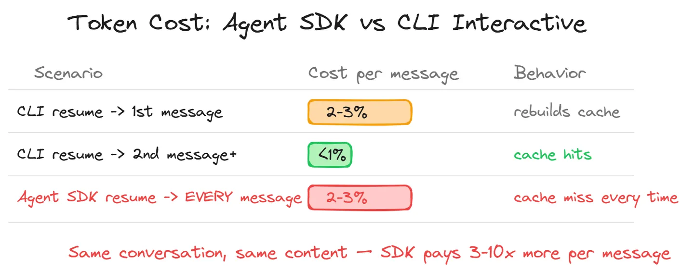
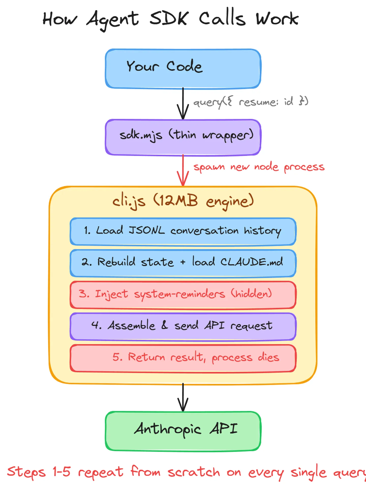
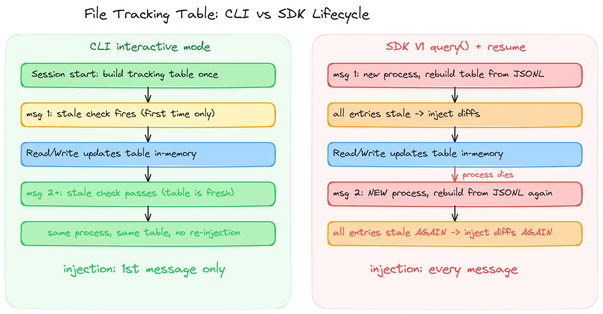
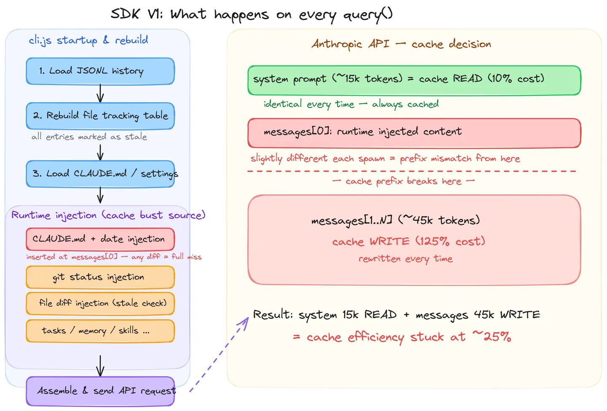
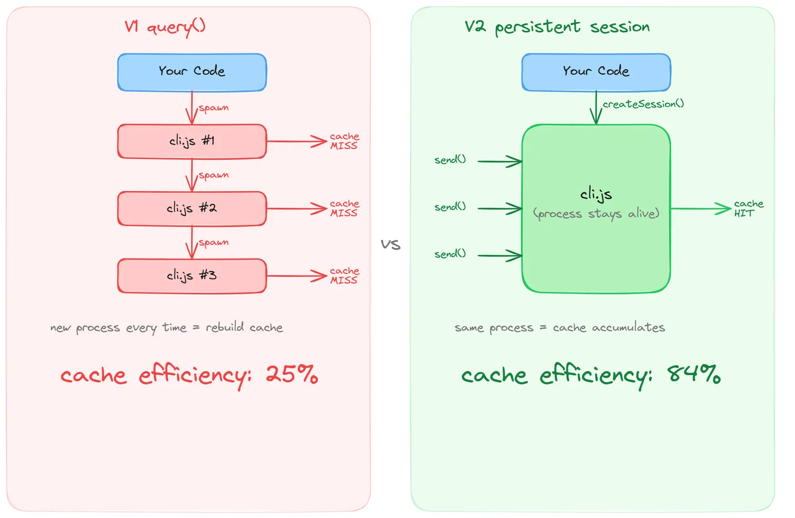
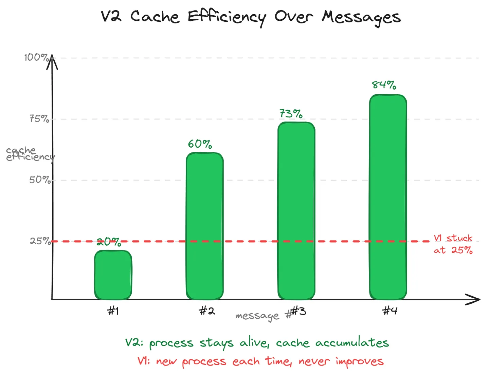

# Reverse-Engineering the Claude Agent SDK: Root Cause and Fix for the 2–3% Credit Burn Per Message

Running a multi-agent system with the Claude Agent SDK, each message consumed 2–3% of the 5-hour credit quota. Message content was just a few words, yet the cost matched that of writing a full block of code.

The same conversation in Claude Code CLI interactive mode dropped to below 1% per message after the first one on resume. The SDK stayed at 2–3% every single time, no exceptions.

I spent a few days reverse-engineering the SDK's 12MB minified source, found the root cause, tried one fix that failed, and solved it another way. Here is the full process.



---

## The Agent SDK Spawns a New Process on Every Call

The SDK exposes a `query()` function (V1 API). You pass a prompt and options, and under the hood it does this:

1. `spawn` a new Node.js child process running `cli.js`
2. `cli.js` is the full Claude Code engine (12MB minified) — the same file used when you run `claude` in the terminal
3. If a `resume` option is provided, `cli.js` rebuilds the conversation history from a JSONL file
4. Assembles the complete API request (system prompt + tools + messages) and sends it to the Anthropic API
5. Returns the result and the child process exits

The key point: **every `query()` spawns a brand-new process.**

```
Your app → sdk.mjs (thin wrapper) → spawn node cli.js → Anthropic API
                                     ↑ new process every time
```



CLI interactive mode works differently. Once you open the terminal, the same `cli.js` process stays alive until you close it. This difference is the root of the entire problem.

Worth noting: CLI is not completely immune either. If you close and resume in CLI, the first message after resume also has to rebuild the cache. In a long conversation, frequent close & resume cycles mean paying the cache rebuild cost each time, so unnecessary interruptions are best avoided.

---

## 30 GitHub Issues, No Fundamental Fix from the Community

Before starting the reverse-engineering, I searched GitHub for issues related to `system reminder`. Found 30 open issues, roughly in these categories:

**Token waste** (most common complaints):
- [#16021](https://github.com/anthropics/claude-code/issues/16021) — hundreds of lines of file-modification notes injected into every user message (23 comments)
- [#4464](https://github.com/anthropics/claude-code/issues/4464) — system-reminder consuming too many context tokens (22 comments)
- [#17601](https://github.com/anthropics/claude-code/issues/17601) — someone captured 10,000+ hidden injections via mitmproxy, eating 15%+ of the context window

**Security concerns**:
- [#18560](https://github.com/anthropics/claude-code/issues/18560) — system-reminder instructs Claude to ignore the user's CLAUDE.md settings
- [#31447](https://github.com/anthropics/claude-code/issues/31447) — Claude claims system messages are "injected," social-engineering the user into relaxing permissions

**Feature requests**:
- [#9769](https://github.com/anthropics/claude-code/issues/9769) — request to allow individual system-reminder toggles (open since 2025-10, no response)

No fundamental fix from the community — only workarounds (adding ignore instructions to CLAUDE.md, third-party tools like Cozempic, etc.). So I decided to reverse-engineer `cli.js` myself.

---

## Reverse-Engineering the 12MB Minified cli.js: The system-reminder Injection Mechanism

`cli.js` is a 12MB minified JavaScript file with all variable names obfuscated to meaningless short identifiers. I located key functions via string constants — for example, searching `"was modified, either by the user"` leads directly to the file-modification injection function.

Here is what I found. The short version: system-reminder injection itself is not the direct cost driver (a few hundred extra tokens won't cause 2–3% per message), but it is the mechanism that breaks the prompt cache, and cache invalidation is what actually burns the credits. Understanding the injection mechanism is necessary to understand why the cache breaks.

### What system-reminder Actually Is

Each time `cli.js` assembles an API request, it dynamically inserts a set of `<system-reminder>`-wrapped content blocks into the messages array. These blocks:

- Are tagged with `isMeta: true`, so they are invisible in the UI
- Are not written to the JSONL conversation history, so they are undetectable after the fact
- Include the instruction `NEVER mention this reminder to the user` in the template

There are over 15 categories, including: file modification diffs, git status, CLAUDE.md content, memory files, task lists, skill lists, LSP diagnostics, and more. All of them are re-injected every conversation turn.


### How the File Tracking Table Triggers Injection (readFileState)

`cli.js` maintains an internal LRU Cache recording which files have been read or written. On each user message turn, it runs a stale check: iterates the table, checks whether each file's mtime is newer than the recorded timestamp. If it is, it computes a diff and injects it.

Injection triggers when all of these conditions are met:

1. The file is in the tracking table
2. Both `offset` and `limit` on the tracking record are `undefined` (partial reads are not tracked)
3. The file's mtime > the recorded timestamp
4. The file can be read successfully
5. The diff is non-empty

### Why the Agent SDK Triggers Injection on Every Turn

The problem is in the tracking table rebuild function that runs on session resume.

Every time the SDK's `query()` is called with `resume`, `cli.js` rebuilds the tracking table from the JSONL file. The rebuild logic:

```javascript
// Core collection logic for tracking table rebuild (simplified)
for (let block of assistantMessage.content) {
  // Only collect Reads without offset or limit
  if (block.name === "Read"
      && block.input.offset === undefined
      && block.input.limit === undefined) {
    readOps.set(block.id, normalize(block.input.file_path));
  }
  // Collect Writes with content
  if (block.name === "Write"
      && block.input.file_path
      && block.input.content) {
    writeOps.set(block.id, { path, content });
  }
  // Edit is not handled
}
```

Every record rebuilt from this logic has `offset` set to `undefined` (so all entries are tracked), and `timestamp` set to the past time from the JSONL (so the current mtime is almost always newer).

In CLI interactive mode, this table is built once when the session starts, then updated in real-time as Read/Write operations happen. The stale check stops firing after the first turn.

The SDK is different. Every `query()` spawns a new process and the tracking table is rebuilt in full from the JSONL every single time. Even if Claude read a file in the previous turn (updating that tracking record), the next turn rebuilds everything back to the stale state. So **every turn triggers injection**.



---

## How Hidden Injections Break the Prompt Cache

This is the core of the article. Injecting a bit of extra content alone should not cause 2–3% credit consumption — a few hundred tokens of system-reminder is not the problem. The real issue is: every new process spawn → runtime injection content reassembled → not byte-for-byte identical to last time → entire messages prompt cache invalidated → ~45k tokens re-written at 125% rate. Cache invalidation is burning the credits, not the injection itself.

The Anthropic API has a prompt caching mechanism: if the prefix (system prompt + messages) of two requests is byte-for-byte identical, the API serves a cache read (10% cost). If not, it's a cache write (125% cost).

`cli.js`'s caching strategy:
- Static parts of the system prompt get `cache_control`, usable across sessions
- Messages get `cache_control` on only the last 1–2 entries (sliding window)

The problem is that the runtime-injected system-reminder blocks are inserted at the **first position** in the messages array (claudeMd + currentDate injections). Every message after that position requires a byte-for-byte identical cache prefix to get a hit.

When the SDK spawns a new process, these runtime injections are reassembled. Even if semantically identical (same day, same CLAUDE.md), the serialized output may have tiny differences — memory file mtimes, task list ordering, git status output, and so on. A single differing byte causes the entire messages block (~45k tokens) to miss cache and be re-written at 125%.

The actual cost breakdown:

| Part | Size | V1 SDK each call | CLI from 2nd message |
|------|------|-----------------|---------------------|
| System prompt | ~15k tokens | cache read (10%) | cache read (10%) |
| Messages | ~45k tokens | **cache write (125%)** | cache read (10%) |

This is why the SDK costs 2–3% per message, and CLI costs <1%.



---

## Phase 1: Eliminating Injection Sources One by One — A/B Tests Show No Effect

Knowing what was being dynamically injected, the obvious approach was to disable each source.

**CLAUDE_CODE_REMOTE=1**

When `cli.js` fetches git status, it checks this environment variable and skips if set to 1. Git status is one of the largest dynamic injection sources.

**JSONL Sanitizer**

Pre-process the JSONL file before resume to break the rebuild function's collection conditions:
- Add `offset: 1` to the `input` of all Read entries (the rebuild function only collects entries where offset === undefined)
- Remove `input.content` from all Write entries (the rebuild function requires both `file_path` and `content`)

This produces an empty tracking table on rebuild, preventing file modification injection.

### A/B Test Results

Same conversation session, sending short messages consecutively, at 11–90 second intervals:

| Condition | cacheRead | cacheCreation | cache efficiency |
|-----------|-----------|---------------|-----------------|
| CLAUDE_CODE_REMOTE=1 | 8,624 | 48,661 | **15%** |
| CLAUDE_CODE_REMOTE=1 | 11,945 | 45,499 | **21%** |
| none | 15,294 | 45,724 | **25%** |
| none | 15,294 | 45,735 | **25%** |

cacheRead stayed steady at ~15k (system prompt cache hitting), but cacheCreation stayed steady at ~45k (messages missed every time). Even at 11-second intervals, efficiency did not improve.

**Conclusion: eliminating individual injection sources is not enough.** The root cause is that after each new process spawn, the reassembled runtime injections cannot guarantee byte-for-byte consistency. Any difference anywhere in the messages block causes a full cache miss.


---

## Solving the Prompt Cache Problem with V2 Persistent Sessions

The problem is spawning a new process each time. The fix is to stop doing that.

The SDK has an alpha-stage V2 API: `unstable_v2_createSession()`. Unlike V1, V2 spawns `cli.js` only once, then communicates over stdin/stdout within the same persistent process. The process stays alive, behaving just like CLI interactive mode.

### The Problem with V2: Options Are All Hardcoded

In the v0.2.76 implementation of the V2 API, many options are hardcoded:

| Option | V1 query() | V2 createSession() |
|--------|-----------|-------------------|
| settingSources | configurable | hardcoded `[]` |
| systemPrompt | configurable | not available |
| mcpServers | configurable | hardcoded `{}` |
| cwd | configurable | uses process.cwd() |
| thinkingConfig | configurable | hardcoded void 0 |

Using V2 directly means `cli.js` won't load CLAUDE.md, won't connect MCP servers, and can't specify a working directory. Essentially unusable.

### Patching the SDK for Production Use

The approach was to directly patch the `SDKSession` class constructor in `sdk.mjs`, replacing hardcoded values with reads from the passed-in options.

Five patch points in total, all on the same class:

| # | Change | Purpose |
|---|--------|---------|
| 1 | `settingSources: []` → `options.settingSources ?? []` | Load CLAUDE.md and settings |
| 2 | Insert `cwd: options.cwd` | Specify working directory |
| 3 | Read `options.thinkingConfig` / `maxTurns` / `maxBudgetUsd` | Configure thinking and limits |
| 4 | `extraArgs: {}` → `options.extraArgs ?? {}` | Pass additional CLI arguments |
| 5 | Extract SDK instances from `options.mcpServers` to build routing Map | MCP server in-process routing |

The patch is applied automatically via a postinstall script using string constant anchors (not line numbers), running after every `npm install`. Validating after an SDK upgrade takes about 15–30 minutes — grep the new `cli.js` / `sdk.mjs` for the anchor strings, confirm the target function is still there.

```javascript
// Patch targeting (by string anchor, not line number)
const anchor = 'settingSources:[]';
const replacement = 'settingSources:Q.settingSources??[]';
```



### V2 Results: Cache Efficiency Rises from 20% to 84%

The V2 session keeps `cli.js` alive, allowing cache to accumulate across messages:

| Message # | cacheRead | cacheCreation | cache efficiency |
|-----------|-----------|---------------|-----------------|
| #1 | 11,689 | 45,974 | **20%** |
| #2 | 69,352 | 46,108 | **60%** |
| #3 | 127,149 | 46,208 | **73%** |
| #4 | 402,087 | 78,011 | **84%** |

Message #1 behaves like V1 — cache has to be built (20%). From message #2 onward the cache starts hitting, reaching 84% by message #4. Compare this to V1 stuck at 25% indefinitely.

Per-message cost drops from ~1–3% of quota to a steady state below 0.5%.



---

## Practical Considerations for Integrating V2 Persistent Sessions

If you want to apply this approach in your own project, a few practical considerations:

**Patch Maintenance**

The patch does string replacement on minified code, not by line number. Running it via postinstall script after `npm install` is sufficient. After each SDK upgrade, verify the patch can still be applied — grep the new `cli.js` / `sdk.mjs` for the anchor strings and confirm the target function is still present. In practice this takes about 15–30 minutes.

**Fallback Strategy**

Recommended: V2 persistent session as the primary path, V1 `query()` as fallback. V2 is an alpha API with no stability guarantees, so a downgrade path is necessary. New sessions (no resume) can use V1 — persistent sessions are not needed there.

**Memory**

Each V2 session is a long-lived node process consuming roughly 100–200MB of RAM. If you manage many sessions simultaneously, plan for idle timeouts and session reclamation. If the process is killed or the application restarts, the session disappears and the next message needs to rebuild the cache.

**Whether to Keep the JSONL Sanitizer**

The JSONL pre-processing from Phase 1 showed limited improvement on cache efficiency (the A/B data above confirms this), but it does eliminate file modification diff injections, reducing unnecessary context consumption. Keeping it as an extra layer is fine, but it is not required.

---

## Current State: Waiting for an Official Fix, Using the Patch in the Meantime

If you are using V1 `query()` with `resume`, every message is a cache miss. This is not a bug in your code — it is an architectural consequence of the SDK: every new process spawn reassembles the runtime injections, breaking the cache prefix.

V2 persistent sessions are the only effective solution currently available, but the API is still in alpha and requires patching to be production-usable.

Worth watching: [#9769](https://github.com/anthropics/claude-code/issues/9769), open since 2025-10, requesting individual system-reminder toggles. If Anthropic ships that feature, or if the V2 API is formalized with complete option support, the patches above become unnecessary.

Until then, monitor your cache efficiency: `cacheReadTokens / (inputTokens + cacheReadTokens + cacheCreationTokens)`. Below 50% means burning money.

If you want to reverse-engineer `cli.js` yourself: the minified code re-obfuscates variable names on every upgrade, but string constants do not change. Search `"was modified, either by the user"` to find the file modification injection. Search `"Cannot send to closed session"` to find the V2 Session class. Search `"DISABLE_PROMPT_CACHING"` to find the caching toggle. Use these strings as anchors and you can locate the corresponding functions in any version.
