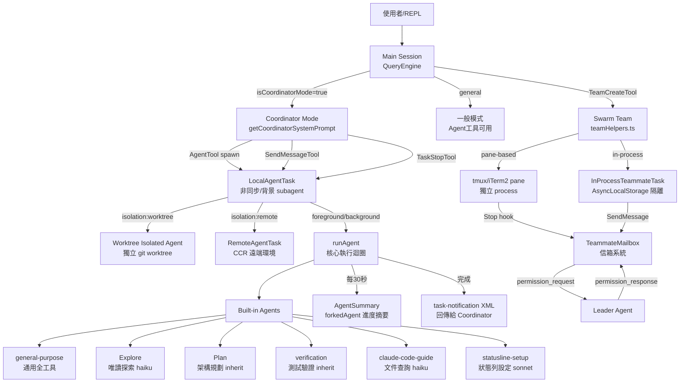

# 01 — Agent 系統架構全景圖

## 1. 系統層次概覽

Claude Code 的 Agent 系統由三個主要層次構成：

```
┌─────────────────────────────────────────────────────┐
│                   使用者 / REPL                        │
│           (Claude Code CLI / UI 介面)                  │
└────────────────────┬────────────────────────────────┘
                     │
┌────────────────────▼────────────────────────────────┐
│              Coordinator / Main Agent                 │
│  (coordinatorMode.ts 或一般 QueryEngine 主執行緒)      │
│  工具: AgentTool, SendMessageTool, TaskStopTool       │
└──────┬──────────────────────┬────────────────────────┘
       │ 派生 (spawn)           │ 通訊 (SendMessage)
┌──────▼──────────┐    ┌──────▼──────────────────────┐
│  LocalAgentTask  │    │  InProcessTeammateTask       │
│  (非同步/背景)   │    │  (同進程/AsyncLocalStorage)  │
└──────┬──────────┘    └──────┬───────────────────────┘
       │                      │
┌──────▼──────────┐    ┌──────▼───────────────────────┐
│ RemoteAgentTask  │    │  Swarm/Team 系統              │
│  (CCR 遠端環境)  │    │  teamHelpers, permissionSync  │
└─────────────────┘    └─────────────────────────────-─┘
```

## 2. 完整架構 Mermaid 圖



## 3. 核心元件說明

### AgentTool (`src/tools/AgentTool/`)
- 主入口：`getPrompt()` 動態組裝工具說明
- `shouldInjectAgentListInMessages()`：Agent 列表注入方式切換（inline vs attachment），節省 cache token
- Fork 模式（`isForkSubagentEnabled()`）：繼承父 context，共享 prompt cache

### 執行模式切換
| 模式 | 觸發條件 | 特性 |
|------|----------|------|
| 一般模式 | 預設 | Agent 工具可用，自行決定派生 |
| Coordinator 模式 | `CLAUDE_CODE_COORDINATOR_MODE=1` | 精簡 prompt，專注調度 |
| Fork 模式 | `isForkSubagentEnabled()=true` | 省略 `subagent_type` 即 fork 自身 |
| In-process | `isInProcessTeammate()=true` | 同進程執行，AsyncLocalStorage 隔離 |

### Task 類型體系

```
TaskState (types.ts)
├── LocalAgentTaskState      — 本地非同步 subagent
├── RemoteAgentTaskState     — CCR 遠端 subagent
├── InProcessTeammateTaskState — 同進程 teammate
├── DreamTaskState           — 記憶鞏固 background agent
├── LocalShellTaskState      — shell 任務
├── LocalWorkflowTaskState   — workflow 任務
└── MonitorMcpTaskState      — MCP 監控任務
```

## 4. 關鍵設計決策

1. **Cache 最佳化**：Agent 列表改為 attachment 注入（`agent_listing_delta`），避免每次 MCP/plugin 變更時全量 bust tool schema cache（節省約 10.2% cache creation tokens）

2. **Fork vs Spawn**：Fork 繼承父 context + prompt cache（便宜），Spawn 全新空白 context（乾淨）

3. **背景/前景雙模**：`run_in_background` 讓 coordinator 繼續其他工作，完成後以 user-role `<task-notification>` 通知

4. **隔離策略**：worktree（git 隔離）、remote（CCR 沙箱）、in-process（AsyncLocalStorage 邏輯隔離）

## 5. 關鍵檔案索引

| 功能 | 檔案 |
|------|------|
| AgentTool prompt | `src/tools/AgentTool/prompt.ts` |
| Coordinator system prompt | `src/coordinator/coordinatorMode.ts` |
| Built-in agent 定義 | `src/tools/AgentTool/built-in/` |
| Task 類型定義 | `src/tasks/types.ts` |
| Swarm 核心 | `src/utils/swarm/` |
| AgentSummary | `src/services/AgentSummary/agentSummary.ts` |
